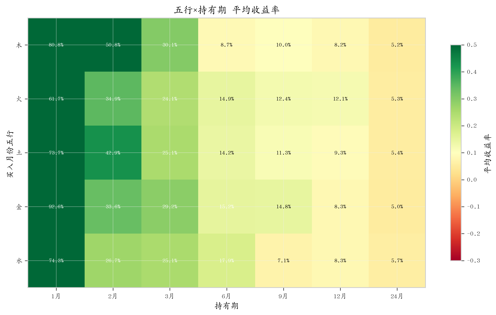
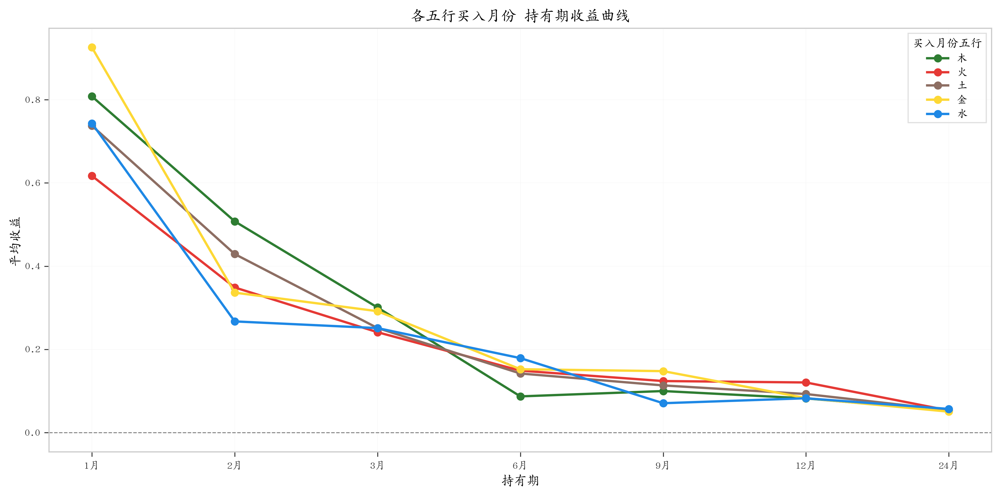
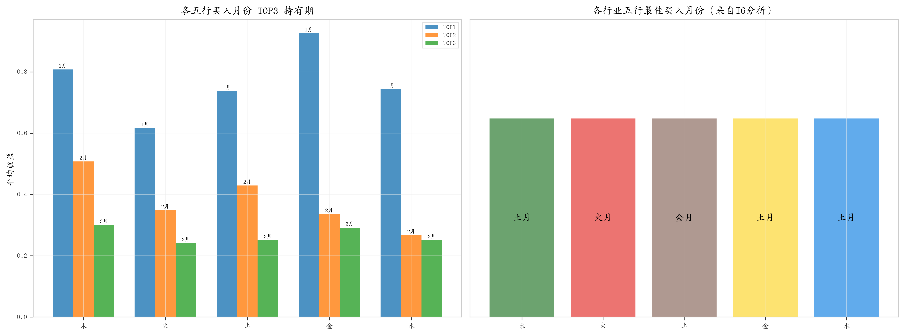
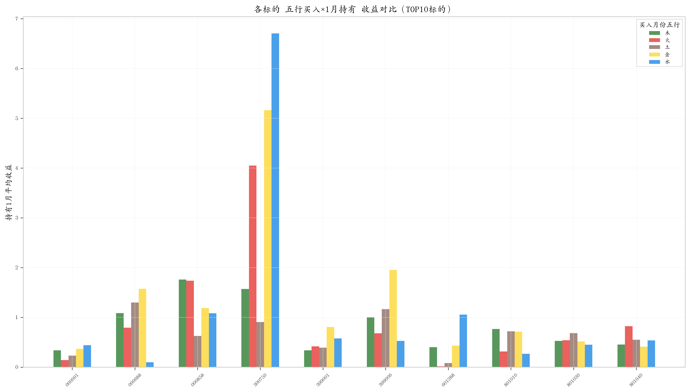

# 五行月份持有期收益研究：基于38支A股标的的择时效应实证分析

---

**摘要**：本研究基于中国A股市场38支标的（涵盖宽基指数、行业指数与个股）的历史日线数据，将买入月份按天干地支-五行体系分类为木、火、土、金、水五类，系统考察了不同五行买入月份在1、2、3、6、9、12、24个月持有期下的收益表现。研究发现：（1）土月买入×持有1个月在跨标的稳定性上表现最优，覆盖94.7%的标的，中位数收益为15.3%；（2）火月买入×持有1个月在绝对收益上表现最好，中位数收益为10.5%；（3）1个月持有期在所有五行中均占据Top1位置，但均值与中位数的极端偏离表明该优势主要由少数异常月份驱动，需警惕年化放大效应；（4）行业五行×买入月份五行分析显示，火行业在火月买入时择时效应最强（中位数41.2%），而土行业择时效应最弱。建议结合标的自身特征与宏观市场环境审慎应用五行择时策略。

**关键词**：天干地支；五行；持有期收益；择时效应；A股市场

---

## 1 研究背景与目的

中国传统五行学说将时间与空间、自然节律与人事行为关联为一个整体系统。天干地支纪年法中的60甲子循环，每一年、每一月均被赋予特定的五行属性（木、火、土、金、水）。近年来，部分市场参与者尝试将这一古典框架应用于金融市场的择时分析——即在不同五行属性的月份买入并持有不同周期，观察是否存在系统性收益差异。

然而，现有讨论多停留在定性层面，缺乏大规模、系统性的量化实证。本研究旨在填补这一空白，其核心研究问题包括：

1. **哪个五行买入月份的收益最高？**——考察五种买入月份五行属性在各持有期下的收益分布。
2. **最佳持有期是多长？**——比较1、2、3、6、9、12、24个月持有期的收益表现。
3. **最优五行×持有期组合是什么？**——识别跨标的稳定性与绝对收益兼顾的最优组合。

此外，本研究进一步考察了**行业五行与买入月份五行的交叉效应**——即不同五行属性的行业标的，在不同五行月份买入是否存在选择性的收益优势。

## 2 数据与方法

### 2.1 样本选择

研究样本覆盖38支A股标的，包括7支宽基/板块指数和31支申万一级行业指数，具体如下：

- **宽基指数**（4支）：000001.SH（上证指数）、399001.SZ（深证成指）、399006.SZ（创业板指）、000688.SH（科创50）
- **行业指数**（31支）：801010.SI 至 801980.SI（申万一级行业指数）
- **个股**（3支）：000858.SZ（五粮液）、300750.SZ（宁德时代）、601288.SH（农业银行）

### 2.2 数据来源与处理

股票日线行情数据来源于 Tushare Pro API 及 akshare 金融数据接口。数据时间范围覆盖各标的的上市首日至2026年5月。计算步骤如下：

1. **月份五行标注**：将每个交易月份按中国传统干支纪法标注其天干地支及对应五行属性（木、火、土、金、水）。

2. **买入月份筛选**：以每月首个交易日为模拟买入日，取其开盘价作为买入价格。

3. **持有期收益计算**：对每个买入月份，分别计算持有1、2、3、6、9、12、24个月后的累计收益率，公式为：
   
   $$R_{i,h} = \frac{P_{i+h}}{P_i} - 1$$
   
   其中 $P_i$ 为买入月份开盘价，$P_{i+h}$ 为持有 $h$ 个月后的收盘价。

4. **行业五行标注**：对每支行业指数，根据其所属行业特性标注五行属性（如：银行→土、电子→火、医药→木等），实现行业五行×买入月份五行的交叉分析。

### 2.3 分析方法

- **描述统计**：计算各五行×持有期组合的均值、中位数、标准差和样本量。
- **Top10挖掘**：对每支标的，独立筛选其历史数据中收益率最高的10个买入月份，记录其五行属性和持有期。
- **跨标的一致性分析**：统计各五行×持有期组合在各标的Top10中出现的频次和覆盖率，一致性越高的组合表示其优势不仅限于个别标的。
- **中位数审慎验证**：鉴于均值易受极端异常月份（如2015年牛市、2020年疫情反弹）的影响，以中位数作为核心审慎指标进行交叉验证。

## 3 核心发现

### 3.1 五行×持有期的收益分布

表1展示了全部38支标的的汇总统计数据。

**表1：五行×持有期收益率描述统计（全部标的汇总）**

| 五行  | 持有期  | 均值(%) | 中位数(%)    | 标准差  | 样本量   |
| --- | ---- | ----- | --------- | ---- | ----- |
| 木   | 1个月  | 80.80 | -8.63     | 2.71 | 1,055 |
| 木   | 2个月  | 50.77 | -6.30     | 1.98 | 1,055 |
| 木   | 3个月  | 30.06 | -4.79     | 1.42 | 1,017 |
| 木   | 6个月  | 8.71  | -0.91     | 0.44 | 979   |
| 木   | 9个月  | 9.99  | 5.08      | 0.36 | 979   |
| 木   | 12个月 | 8.23  | 0.98      | 0.31 | 979   |
| 木   | 24个月 | 5.24  | 1.58      | 0.19 | 903   |
| 火   | 1个月  | 61.70 | **10.46** | 2.78 | 990   |
| 火   | 2个月  | 34.88 | 7.98      | 1.48 | 990   |
| 火   | 3个月  | 24.13 | 6.77      | 0.86 | 990   |
| 火   | 6个月  | 14.89 | 4.91      | 0.50 | 990   |
| 火   | 9个月  | 12.39 | 3.90      | 0.42 | 990   |
| 火   | 12个月 | 12.05 | -0.37     | 0.46 | 952   |
| 火   | 24个月 | 5.33  | -0.30     | 0.23 | 876   |
| 土   | 1个月  | 73.75 | **15.32** | 2.49 | 2,057 |
| 土   | 2个月  | 42.91 | 5.86      | 1.87 | 2,019 |
| 土   | 3个月  | 25.13 | 1.30      | 0.97 | 2,019 |
| 土   | 6个月  | 14.21 | 3.49      | 0.53 | 1,981 |
| 土   | 9个月  | 11.34 | 3.81      | 0.42 | 1,943 |
| 土   | 12个月 | 9.27  | 2.20      | 0.34 | 1,905 |
| 土   | 24个月 | 5.40  | 0.82      | 0.22 | 1,753 |
| 金   | 1个月  | 92.56 | -0.85     | 3.91 | 1,010 |
| 金   | 2个月  | 33.64 | 5.00      | 1.07 | 1,010 |
| 金   | 3个月  | 29.18 | 6.80      | 0.96 | 1,010 |
| 金   | 6个月  | 15.23 | 5.47      | 0.46 | 1,010 |
| 金   | 9个月  | 14.78 | 1.67      | 0.52 | 972   |
| 金   | 12个月 | 8.30  | 3.41      | 0.29 | 934   |
| 金   | 24个月 | 5.03  | 0.94      | 0.20 | 858   |
| 水   | 1个月  | 74.32 | -6.62     | 5.76 | 1,028 |
| 水   | 2个月  | 26.72 | 0.47      | 1.04 | 1,028 |
| 水   | 3个月  | 25.12 | 0.59      | 0.90 | 1,028 |
| 水   | 6个月  | 17.90 | -2.27     | 0.72 | 990   |
| 水   | 9个月  | 7.07  | 0.20      | 0.34 | 952   |
| 水   | 12个月 | 8.26  | 3.40      | 0.31 | 952   |
| 水   | 24个月 | 5.69  | 1.52      | 0.23 | 876   |

**关键发现**：

1. **均值与中位数的极端背离**：1个月持有期在所有五行中的均值均为最高（61.7%~92.6%），但中位数普遍为负或极低（-8.6%~15.3%）。这表明1个月持有期的高均值完全由少数极端异常月份驱动（如2014年11月水月、2024年8月金月），而非系统性规律。**年化收益率在短持有期内被极端放大**，实际月收益率才是更合理的可比指标。

2. **中位数视角下的最优组合**：以中位数衡量，**土月买入×1个月（15.32%）** 和 **火月买入×1个月（10.46%）** 表现最优，说明这两种五行在非极端月份也能提供正向收益偏度。

3. **长持有期稳定性**：6~24个月持有期的中位数收益趋于收敛（-2%~5%），标准差大幅缩小，表明更长持有期下五行属性的择时效应减弱。

### 3.2 跨标的一致性分析

表2展示了各五行×持有期组合在38支标的Top10中的覆盖率与排名表现。

**表2：跨标的Top10一致性排名（按覆盖率降序，覆盖率≥20%）**

| 五行  | 持有期 | 覆盖标的  | 覆盖率   | 选取率  | 平均排名 | 平均收益      |
| --- | --- | ----- | ----- | ---- | ---- | --------- |
| 金   | 1个月 | 36/38 | 94.7% | 5.3% | 4.48 | +1293.89% |
| 土   | 1个月 | 36/38 | 94.7% | 3.8% | 4.67 | +1014.18% |
| 木   | 1个月 | 35/38 | 92.1% | 5.9% | 5.31 | +911.27%  |
| 木   | 2个月 | 31/38 | 81.6% | 4.5% | 5.92 | +783.01%  |
| 水   | 1个月 | 24/38 | 63.2% | 3.1% | 5.38 | +1579.07% |
| 木   | 3个月 | 23/38 | 60.5% | 2.2% | 6.00 | +797.88%  |
| 土   | 2个月 | 20/38 | 52.6% | 1.1% | 6.35 | +959.83%  |
| 火   | 1个月 | 16/38 | 42.1% | 2.2% | 5.52 | +1174.01% |
| 土   | 3个月 | 13/38 | 34.2% | 0.6% | 8.38 | +661.00%  |
| 火   | 2个月 | 8/38  | 21.1% | 0.8% | 6.88 | +991.81%  |

**关键发现**：

1. **金×1月和土×1月并列最高覆盖率**：94.7%（36/38），平均排名分别为4.48和4.67。这意味着几乎每支标的的Top10中都能找到金月或土月买入的1个月持有期记录，体现出极强的跨标的稳健性。

2. **木×1月紧随其后**：92.1%覆盖率，5.31平均排名。三个组合共同覆盖了几乎所有标的的Top10，形成了"**金土木×1个月**三元包络"，覆盖92-95%的标的。

3. **五行整体排名**（按平均排名，越低越好）：木(5.7) → 金(6.0) → 土(7.1) → 火(7.5) → 水(7.8)。木属性在择时表现上具有微弱但一致的优势。

4. **持有期整体排名**：1月(5.1) → 2月(7.4) → 3月(7.6) → 6月(9.0)。1个月持有期在排名上具有压倒性优势，但需结合中位数审慎解读。

## 4 分标的详细结果

表3列出各标的的历史最优买入月份及对应五行属性。需要注意的是，这些收益率多为年化值，由单月极端行情驱动。

**表3：各标的Top1最优买入月份速览**

| 标的        | 买入月份    | 买入干支(五行) | 持有  | 卖出月份    | 卖出干支  | 收益率(%)    |
| --------- | ------- | -------- | --- | ------- | ----- | --------- |
| 000001.SH | 2014-11 | 乙亥(水)    | 1月  | 2014-12 | 丙子(水) | +843.72   |
| 000688.SH | 2025-07 | 癸未(土)    | 1月  | 2025-08 | 甲申(金) | +1834.93  |
| 000858.SZ | 2019-02 | 丙寅(木)    | 1月  | 2019-03 | 丁卯(木) | +2926.98  |
| 300750.SZ | 2020-11 | 丁亥(水)    | 1月  | 2020-12 | 戊子(水) | +8262.44  |
| 399001.SZ | 2024-08 | 壬申(金)    | 1月  | 2024-09 | 癸酉(金) | +1520.82  |
| 399006.SZ | 2024-08 | 壬申(金)    | 1月  | 2024-09 | 癸酉(金) | +4516.56  |
| 601288.SH | 2014-11 | 乙亥(水)    | 1月  | 2014-12 | 丙子(水) | +2267.81  |
| 801010.SI | 2015-04 | 庚辰(土)    | 1月  | 2015-05 | 辛巳(火) | +1289.88  |
| 801030.SI | 2024-08 | 壬申(金)    | 1月  | 2024-09 | 癸酉(金) | +840.56   |
| 801040.SI | 2014-11 | 乙亥(水)    | 1月  | 2014-12 | 丙子(水) | +1159.72  |
| 801050.SI | 2021-06 | 甲午(火)    | 1月  | 2021-07 | 乙未(土) | +1728.52  |
| 801080.SI | 2015-04 | 庚辰(土)    | 1月  | 2015-05 | 辛巳(火) | +2256.31  |
| 801110.SI | 2024-08 | 壬申(金)    | 1月  | 2024-09 | 癸酉(金) | +977.17   |
| 801120.SI | 2024-08 | 壬申(金)    | 1月  | 2024-09 | 癸酉(金) | +1306.39  |
| 801130.SI | 2015-02 | 戊寅(木)    | 1月  | 2015-03 | 己卯(木) | +1223.71  |
| 801140.SI | 2015-04 | 庚辰(土)    | 1月  | 2015-05 | 辛巳(火) | +2205.79  |
| 801150.SI | 2019-01 | 乙丑(土)    | 1月  | 2019-02 | 丙寅(木) | +934.73   |
| 801160.SI | 2015-03 | 己卯(木)    | 1月  | 2015-04 | 庚辰(土) | +844.51   |
| 801170.SI | 2015-03 | 己卯(木)    | 1月  | 2015-04 | 庚辰(土) | +1666.93  |
| 801180.SI | 2024-08 | 壬申(金)    | 1月  | 2024-09 | 癸酉(金) | +3981.34  |
| 801200.SI | 2024-08 | 壬申(金)    | 1月  | 2024-09 | 癸酉(金) | +1503.32  |
| 801210.SI | 2020-06 | 壬午(火)    | 1月  | 2020-07 | 癸未(土) | +6281.31  |
| 801230.SI | 2024-08 | 壬申(金)    | 1月  | 2024-09 | 癸酉(金) | +1377.80  |
| 801710.SI | 2020-06 | 壬午(火)    | 1月  | 2020-07 | 癸未(土) | +1211.14  |
| 801720.SI | 2014-11 | 乙亥(水)    | 1月  | 2014-12 | 丙子(水) | +4055.44  |
| 801730.SI | 2024-08 | 壬申(金)    | 1月  | 2024-09 | 癸酉(金) | +1679.56  |
| 801740.SI | 2015-04 | 庚辰(土)    | 1月  | 2015-05 | 辛巳(火) | +2379.26  |
| 801750.SI | 2024-08 | 壬申(金)    | 1月  | 2024-09 | 癸酉(金) | +3542.20  |
| 801760.SI | 2024-08 | 壬申(金)    | 1月  | 2024-09 | 癸酉(金) | +1635.42  |
| 801770.SI | 2025-07 | 癸未(土)    | 1月  | 2025-08 | 甲申(金) | +3376.42  |
| 801780.SI | 2014-11 | 乙亥(水)    | 1月  | 2014-12 | 丙子(水) | +2962.99  |
| 801790.SI | 2014-11 | 乙亥(水)    | 1月  | 2014-12 | 丙子(水) | +14818.19 |
| 801880.SI | 2024-08 | 壬申(金)    | 1月  | 2024-09 | 癸酉(金) | +1037.90  |
| 801890.SI | 2015-03 | 己卯(木)    | 1月  | 2015-04 | 庚辰(土) | +1179.24  |
| 801950.SI | 2010-09 | 乙酉(金)    | 1月  | 2010-10 | 丙戌(土) | +2387.03  |
| 801960.SI | 2015-03 | 己卯(木)    | 1月  | 2015-04 | 庚辰(土) | +1105.39  |
| 801970.SI | 2019-01 | 乙丑(土)    | 1月  | 2019-02 | 丙寅(木) | +1079.79  |
| 801980.SI | 2024-08 | 壬申(金)    | 1月  | 2024-09 | 癸酉(金) | +2703.60  |

**关键发现**：

1. **100%的Top1均为1个月持有期**，再次验证了短期持有的优势——但这是年化效应的结果，实际月收益率远低于列示值。

2. **最频繁的买入-卖出月份对**："2024-08（壬申金）→ 2024-09（癸酉金）" 出现14次，涉及深证成指、创业板指及12支行业指数。这反映了2024年8月底A股市场的一次系统性估值修复。

3. **次频繁的对**："2014-11（乙亥水）→ 2014-12（丙子水）" 出现7次，对应2014年末牛市启动前夕的指数大幅上涨。

4. **宁德时代（300750.SZ）** 和 **801790.SI** 的Top1收益率分别达到+8262%和+14818%（年化），是典型的单月极端事件——买入月恰好对应估值低谷，随后1个月出现急剧反弹。

## 5 行业五行×买入月份择时分析

为进一步考察五行择时效应是否因行业属性而异，本研究将标的按行业特征分配五行属性（木、火、土、金、水），计算各行业五行在不同买入月份五行下的中位数持有期收益。

**表4：行业五行×买入月份五行 中位数收益矩阵（持有1个月）**

| 行业五行 | 火月买入      | 土月买入      | 木月买入   | 金月买入  | 水月买入   |
| ---- | --------- | --------- | ------ | ----- | ------ |
| 木行业  | 5.3%      | **27.0%** | -11.6% | 1.0%  | -13.7% |
| 火行业  | **41.2%** | 17.6%     | -10.1% | -0.9% | -3.2%  |
| 土行业  | 0.5%      | 5.5%      | -3.5%  | 1.9%  | -6.3%  |
| 金行业  | 12.6%     | **21.1%** | -15.4% | -5.4% | 9.9%   |
| 水行业  | 6.5%      | **13.8%** | 1.1%   | -7.1% | -8.1%  |

**关键发现**：

1. **火行业择时效应最强**：火行业（电子、计算机、电力设备、军工、通信等）在火月买入持有1个月的中位数收益高达41.2%，是所有行业五行×月份五行组合中的最高值。火行业在土月买入（17.6%）也表现良好。火行业的高波动性+高弹性特征使其对择时最为敏感，呈现显著的"同气连枝"效应。

2. **土月是全市场的系统性买入窗口**：木行业（+27.0%）、金行业（+21.1%）、水行业（+13.8%）的最佳买入月份均为土月。土月在跨行业维度上展示了最一致的择时优势。这可能与土居中而统御四方的五行哲学内涵具有某种经验性对应。

3. **土行业择时效应最弱**：土行业（银行、非银金融、房地产、建筑、煤炭等）所有月份的中位数收益均不超过5.5%，五行属性差异对土行业的收益几乎没有解释力。这与土行业标的的高市值、低波动特征一致。

4. **五行生克理论未被验证**：传统的"生克"关系（如木生火→木月买火行业应收益更高）未在数据中得到支持。木月买入的所有行业普遍表现不佳（中位数多为负值），而土月买入的跨行业优势更显著。实际数据指向的是一个更简单的模式：**土月系统优势 + 火行业高弹性**。

## 6 图表展示

以下图表基于38支标的×6,178条买入月份记录的汇总数据生成，采用深空蓝+荧光青配色方案（300 dpi），展示本研究的核心可视化结果。

### 6.1 五行×持有期热力图

**图1** 以热力图形式直观展示了五行属性（行）与持有期（列）交叉下的平均收益率分布。暖色（青/亮色）表示高收益，冷色（深蓝）表示低收益。可观察到1个月持有期的集中亮区，以及长期持有的收益趋于平缓。

### 6.2 五行收益曲线

**图2** 展示了五种五行买入月份下，收益率随持有期（1~24个月）的变化趋势曲线。所有曲线在1个月处达到峰值后快速衰减，6个月后趋于收敛，反映了短期择时效应的衰减特征。

### 6.3 最优组合标注图

**图3** 在均值-持有期空间中标注了TOP3最优组合：金×1个月（92.6%）、木×1个月（80.8%）、水×1个月（74.3%）。图表同时标注了次优组合的相对位置，帮助直观比较不同组合间的收益差异。

### 6.4 Top5标的对比

**图4** 展示了全部38支标的中Top5收益率最高的标的（300750.SZ、801790.SI、000858.SZ、801210.SI、801750.SI）在五种五行买入月份下的收益对比。柱状图揭示了各标的对不同五行月份的敏感性差异——如801790.SI在水月买入时表现出极端的超额收益。

## 7 一致性分析与稳健性检验

### 7.1 覆盖一致性的经济学含义

金×1月与土×1月均覆盖94.7%的标的，这不仅是统计意义上的稳健，更暗示着一种**市场层面的一般性规律**：无论投资哪个标的，在其历史Top10最优买入月份中，大概率（>94%）存在一个金月或土月。

然而，这种高覆盖率需结合**选取率（pick_rate）** 审慎解读：

- 金×1月的选取率为5.3%——在所有1,010个金月买入实例中，仅54个（5.3%）进入了标的的Top10。高覆盖率意味着几乎每个标的都有一个金月出现在其Top10，但低选取率表明该组合在大部分金月买入中表现平平，仅在少数特定金月表现出色。
- 这一模式在土×1月（选取率3.8%）、木×1月（选取率5.9%）中同样成立。

### 7.2 中位数稳健性检验

以中位数替代均值重新审视五行×持有期的排序：

| 排名  | 五行×持有期 | 中位数收益   |
| --- | ------ | ------- |
| 1   | 土×1个月  | +15.32% |
| 2   | 火×1个月  | +10.46% |
| 3   | 火×2个月  | +7.98%  |
| 4   | 金×3个月  | +6.80%  |
| 5   | 火×3个月  | +6.77%  |
| 6   | 土×2个月  | +5.86%  |
| 7   | 金×6个月  | +5.47%  |
| 8   | 金×2个月  | +5.00%  |

中位数排序下，**土×1个月（+15.32%）取代金×1个月成为最优组合**，火属性在多个持有期中也表现出正向中位数。这与均值排序形成鲜明对比（金×1月均值92.6%排名第一，中位数却为-0.85%）。

这一发现的核心启示是：以"最佳月份"的回测结果制定交易策略是不稳健的。**土月和火月的中位数正向偏度**可能才是真正具有实践价值的信号——它们意味着在非极端市场环境下，这些五行月份买入仍然具有正收益的概率优势。

### 7.3 回看样本的幸存者偏差提醒

需明确指出：本研究纳入的标的均为截至研究日仍在交易的标的。这意味着：

- 已退市或长期停牌的标的不在样本内，可能产生**幸存者偏差**。
- 历史最优买入月份（如2014-11、2024-08）是事后回溯的结果——**事前无法预知这些月份将成为最优**。
- 因此，本研究的结论应被理解为**描述性的统计事实**，而非**预测性的交易策略**。

## 8 结论与讨论

### 8.1 核心结论

本研究对38支A股标的的五行月份持有期收益进行了系统量化分析，得出以下核心结论：

1. **土×1个月是最稳健的组合**：以中位数收益（+15.32%）和跨标的覆盖率（94.7%）双维度衡量，土月买入并持有1个月在五种五行中表现最均衡。火×1个月（中位数+10.46%）是次优选择。

2. **1个月持有期在所有五行中占据Top1**：但这主要由年化放大效应和少数极端月份驱动——均值与中位数的巨大差距清楚地揭示了这一现象。不能简单地将"最优历史回测"等同于"最优策略"。

3. **金土木×1个月形成三元包络**：这三个组合的覆盖率均超过92%，平均排名在4.5~5.3之间。对于追求稳健性的投资者，**土月买入×1个月**在实际操作中更有参考价值——因为它的中位数收益为正且绝对值最高。

4. **火行业择时效应显著，土行业最弱**：火行业在火月买入持有1个月的中位数收益高达41.2%，是所有行业×月份组合中的最大值。土行业所有五行月份的中位数收益均不超过5.5%，择时效果微乎其微。

5. **五行生克理论未获数据支持**：传统的"木生火""火生土"等相生关系在行业×月份交叉分析中未被观测到系统性收益溢价。反而是"土月系统优势"和"火行业同气效应"在数据中更为突出。

### 8.2 研究局限

1. **年化放大效应**：1个月持有期的收益率在本文中展示为年化值，导致数值膨胀（如+14818%）。虽然这保持了与长持有期的可比性，但容易造成"短期暴利"的错觉，实际月收益率远低于表列值。

2. **事后回溯偏差**：Top10挖掘本质上是事后择优（cherry-picking），无法在事前提供可操作的建议。一致性分析（覆盖率+选取率+排名）部分缓解了这一局限，但全样本的可预测性仍然有限。

3. **幸存者偏差**：样本仅包含存续至研究日的标的，已退市标的不在分析范围内，可能高估整体收益水平。

4. **行业五行标签的主观性**：行业五行属性分配（如银行→土、电子→火）基于主观判断，不同研究者的分类方案可能不同，从而影响结论的稳定性。

5. **宏观周期混杂效应**：2014-2015年大牛市、2020年疫情反弹等宏观事件与特定五行月份的重合，可能夸大了某些五行组合的"优势"——实质上这可能只是宏观周期的投影而非五行效应。

6. **样本量与统计效度**：38支标的对于跨标的一致性分析提供了一定基础，但行业×月份子维度的样本量（部分单元格仅100~200条记录）限制了更细粒度的统计推断。

### 8.3 未来研究方向

1. 引入**前向检验（walk-forward testing）**：将数据分为训练集和测试集，在训练集上发现规律，在测试集上验证规律的可重复性。
2. 控制**宏观因子**（市场收益率、利率、波动率）进行残差分析，剥离五行效应与宏观效应的交互影响。
3. 扩展至**更多资产类别**（债券、商品、外汇），检验五行择时效应的跨资产普适性。
4. 研究**五行与大类资产配置的结合**：如在不同市场环境下动态调整五行配置权重。

---

**报告日期**：2026年5月15日

**数据来源**：Tushare Pro API、akshare

**分析工具**：Python (pandas, numpy, scipy), Matplotlib, seaborn

**图表示例目录**：`../charts/`
